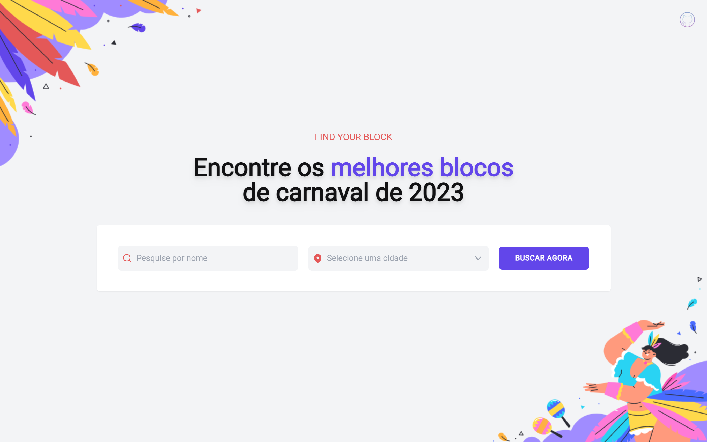

<h1 align="center">
  CodeBloco
</h1>

   
   
   
   
   

  
   

[**Projeto**](#-projeto) &nbsp;&nbsp;**|**&nbsp;&nbsp;
[**Tecnologias**](#-tecnologias) &nbsp;&nbsp;**|**&nbsp;&nbsp;
[**Como executar**](#-como-executar) &nbsp;&nbsp;**|**&nbsp;&nbsp;
[**Layout**](#-layout) &nbsp;&nbsp;**|**&nbsp;&nbsp;
[**Deploy**](#-deploy) &nbsp;&nbsp;**|**&nbsp;&nbsp;

## 💻 Projeto

Aplicação para encontrar blocos de carnaval. Desafio #7 do [#BoraCodar](https://www.rocketseat.com.br/boracodar) da [Rocketseat](https://rocketseat.com.br/).

## ✨ Tecnologias

- [TypeScript](https://www.typescriptlang.org/)
- [Vite](https://vitejs.dev/)
- [React](https://reactjs.org/)
- [TailindCSS](https://tailwindcss.com/)
- [HeadlessUI](https://headlessui.com/)
- [Zustand](https://docs.pmnd.rs/zustand/getting-started/introduction)
- [Axios](https://axios-http.com/)
- [React Google Maps Api](https://react-google-maps-api-docs.netlify.app/)
- [Formik](https://formik.org/)
- [Sanity](https://www.sanity.io/)

## 🚀 Como executar

- Clone o repositório com `git clone https://github.com/raffaez/codebloco`
- Instale os pacotes com `yarn`
- Faça uma cópia do arquivo `.env.example`, renomeie para `.env` e preencha com as suas variáveis de ambiente
- Execute `yarn dev` para iniciar o servidor de desenvolvimento

## 🔖 Layout

Você pode visualizar o layout do projeto no [Figma](http://figma.com/) através do link abaixo:

- [Layout](https://www.figma.com/community/file/1207675804423978995)

---